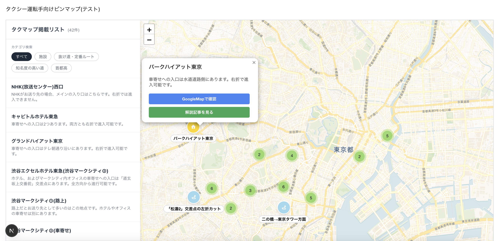

# 新人タクシー運転手向けピンマップ(サンプル)

東京都の都心部で運行する新人のタクシー運転手が、効率的に必要な地理知識を習得できるようにするためのマップです。

実際に公開しているサイトはこちら:
[タクシー運転手向けピンマップ](https://sample-map-eight.vercel.app/)

## 機能

- ビジュアルで確認できる電子地図: 視覚的に地図を確認しながら、タクシーを運行する際に必要なスポットをまとめて閲覧できます。
- 詳細情報のチェック: 情報を閲覧したいピンを選択すると、ポップアップが出現します。ポップアップには簡単な概要と GoogleMap へのリンク、運転手向けウェブサイト「東京都心タクマップ」の記事へのリンクが表示されています。
- コンテンツの一覧表示: サイドバーでコンテンツの一覧を閲覧することができます。カテゴリでフィルタリングすることも可能です。
- クラスタリング: 地図がある程度ズームアウトすると、ピンがクラスタリングされて表示されます。UI が崩れ、ユーザビリティが悪くなるのを防いでいます。
- レスポンシブ対応: デバイスの大きさによってサイドバーなど周辺パーツの位置を調整し、視認性が悪くならないようにしています。

## 使用技術

- フロントエンド: Next.js、TypeScript、Tailwind CSS
- バックエンド: なし
- API: なし
- ホスティング: Vercel

## セットアップ方法

Docker および Docker Compose が使える環境で行ってください。

1.リポジトリのルートで次のコマンドを実行してください。
docker compose up --build

1. 起動したら、ブラウザで http://localhost:3000 を開いてください。

### 停止

ターミナルで Ctrl+C を実行してください。
